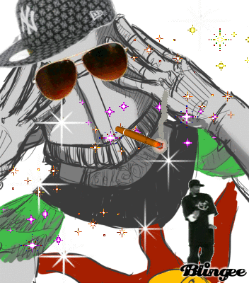

Sunbro.js
=========



Not having decent string formatting in JavaScript is a pain. Even worse, a lot of the libraries that attempt it out there never learned the mistakes of their fathers and use C-style holders for substitution such as %d. The problem with these is that when translating strings to different languages other than the one they were written in, the placement of these can change and code can break. Here's an example of Sunbro in action:

```javascript
Sunbro.format("hello {1} my {0}",{ 0: "friend", 1: "world" }); // Returns "hello world my friend"
```

As you can see, I went for C# style curly braces because:

* I like them
* I don't like using more than one character per left and right of the dictionary key
* They're familiar to at least some people
* The regex is simple enough that you should be able change them to whatever you like

Note that you can place strings inside the template like `{name}` and it'll work just dandy. Even using escaping on double braces the library is still 5x-10x faster than using Lodash's _.template function.

## Things to watch out for

Escaping is optional. If you need to escape a brace pass `true` as an optional third parameter. Internally, this is dealt with pretty simply. Double braces are replaced with a rare UTF-8 string before substitution and then a single one is put back after. Here's an example:

```javascript
Sunbro.format("hello {1} my {{0}",
    {
        0: "friend",
        1: "world"
    },
    true); // Returns "hello world my {0}"
```

By passing a forth and fifth optional parameter, you can change the internal placeholders (by default `♛☊♛` for { and `♛☋♛` for }) in case the provided string contains them, or you suspect someone is going to try and provide them (IN WHICH CASE, PLEASE SORT OUT YOUR SECURITY, YOU SHOULDN'T BE FORMATTING USER INPUT).

Unless you're the king of headphones, it's unlikely you'll need to do this, but it must be present because of a slightly brittle substitution quirk: a dictionary key containing one of the placeholders. Consider the following:

```javascript
Sunbro.format("hello {{{♛☊♛1} my {0}",
    {
        0: "friend",
        1: "world",
        "♛☊♛1": "broken"
    },
    true); // Returns "hello {broken my friend"
```

This is unfortunate but there's a simple reason I haven't addressed it: Escaping is something I'll probably never have to do. The only time I would use need braces 99% of the time is because I'm working with HTML and for that case, I'd use _.template or something similar. Use this library for your logger or simple apps, it's not meant to generate HTML. Most of the time, when you do need to escape, it'll be grand.

If you want to fix this go ahead and send a pull request! Make sure to do a jsperf comparison with the current implementation though.

## Other things that would be nice

* A npm package
* A nuget package
* Tons, tons more tests

## Praise the sun, or send me horrible messages

* [@johnnycbadde](https://twitter.com/johnnycbadde)
* [Blog](https://thomasgeraghty.wordpress.com)